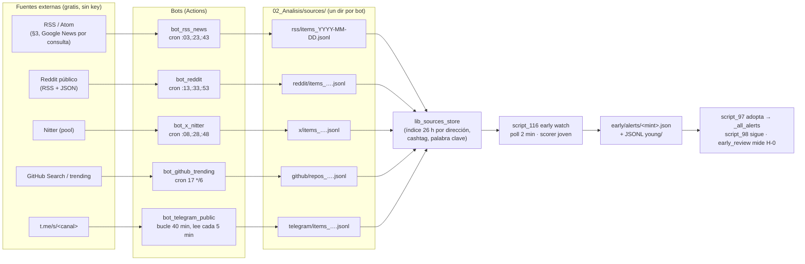

# 33 — Arquitectura multi-bot de fuentes informacionales

Rótulos: [V] verificado · [I] inferido · [H] hipótesis · [P] pendiente (lo ejecuta YIN o un workflow con red).

Objetivo: darle materia prima a las señales informacionales del scorer joven (doc 32). Hoy el almacén de menciones
tiene **43 ítems en 26 h** [V, 02/10]. Para Dirección no es un bloqueo: es tarea, ampliar fuentes.

## 1. La propuesta de Dirección, confirmada o corregida

| Bot propuesto | Cadencia | Veredicto | Cambio y motivo |
|---|---|---|---|
| `bot_rss_news` | 1 h | **Confirmado, cada 20 min** | Los feeds publican varias veces por hora y un RSS es barato (1 GET por feed). Con 1 h, la noticia llega tarde para un token de < 60 min. Suma los feeds de §3. |
| `bot_telegram_public` | 5 min | **Confirmado, pero no como cron** | Un cron de 5 min en Actions no se cumple: el scheduler se atrasa 11,9 min de media [V, doc 31 §1]. Va **dentro del bucle largo** (como el early watch): un job de 40 min que lee `t.me/s/<canal>` cada 5 min. |
| `bot_github_trending` | 6 h | **Confirmado** | Repos nuevos de Solana / IA / DePIN (Search API con `GITHUB_TOKEN`, 1.000 req/h en Actions) + `github.com/trending`. Es la señal "repos" de narrativa de mediano plazo. |
| `bot_mcp_news` | 30 min | **Corregido: no como bot aparte** | Un MCP es una interfaz para un cliente LLM; en un workflow conviene llamar directo a la fuente que el MCP envuelve (RSS, Reddit público, Nitter). Los MCP de §2 se usan como **referencia de implementación**. Solo se llama un MCP **hosteado** cuando no hay endpoint directo (por ejemplo, `kukapay-news-mcp`) [P]. Para eso ya existe un cliente: `script_34b_mcp_stdio_client.py`. |
| `bot_dextools` | 10 min | **Corregido: no se crea** | La API de DEXTools pide key de plan; que haya un nivel gratis sin tarjeta no está verificado [P]. Lo que daría ya lo cubre script_116 cada 2 min (DexScreener: pares, perfiles y boosts). Se puede sumar **GeckoTerminal** `trending_pools` / `new_pools` (gratis, 30 req/min) **dentro del early watch**, no como bot. |
| `bot_reddit` | 20 min | **Confirmado, absorbe la familia Reddit de script_115** | script_115 ya lee 5 subreddits cada 20 min; dos lectores duplicarían la carga sobre el RSS anónimo, que Reddit limita por IP. `bot_reddit` toma esa familia, suma los subreddits de §3 y, como opción, los comentarios vía las rutas públicas que usa `reddit-no-auth-mcp-server` [P]. |
| `bot_aggregator` | 5 min | **Corregido: biblioteca, no bot** | Un agregador con cron propio suma un salto de commit y ~12 min de retraso del scheduler. Va como **`lib_sources_store`**, leído por script_116 en cada poll de 2 min (donde ya se puntúa). |
| (nuevo) `bot_x_nitter` | 20 min | **Agregado** | X/Twitter vía el pool de instancias de Nitter. La lógica de `nitter-mcp` (MIT) detecta instancias que responden 200 con feeds viejos. Cuentas: lanzadores, agregadores, KOL de Solana. Muy frágil [P]: si no hay instancias sanas, el bot no escribe nada (no falla). |

## 2. Flujo

## 3. Storage por bot (un dueño por archivo, sin conflictos de git)

| Bot | Escribe | Formato de ítem | Retención | Commit |
|---|---|---|---|---|
| `bot_rss_news` | `02_Analisis/sources/rss/items_<fecha>.jsonl` + `_state.json` (ETag / último id por feed) | `{ts, src, fam, a: [direcciones], c: [cashtags], n: [nombres], kw: [palabras clave], h: hash del texto, u: hash del autor}`: **solo identificadores**, como script_115 (sin textos ni handles) | Archivos diarios; los mayores a 7 días se borran | Cada corrida, pull --rebase |
| `bot_reddit` | `sources/reddit/…` | Igual + `score` / `comments` del post | Ídem | Ídem |
| `bot_x_nitter` | `sources/x/…` + `_instances.json` (salud del pool) | Igual + `author_tier` (seguidores, si Nitter lo da) | Ídem | Ídem |
| `bot_github_trending` | `sources/github/repos_<fecha>.jsonl` | `{ts, repo, created_at, stars, stars_delta_6h, topics, kw}` | 30 días | Cada 6 h |
| `bot_telegram_public` | `sources/telegram/…` | Igual que RSS + `views` del post | 7 días | Cada 10 min dentro del bucle |
| `lib_sources_store` (en script_116) | **Solo lee.** Índice en memoria: dirección → [(ts, fam, peso)], cashtag → …, palabra clave → … | — | Ventana de 26 h | — |

**Señales que alimenta** (doc 32): `mentions` (dirección o cashtag en cualquier familia, ponderado por cantidad de
familias distintas, como la corroboración entre fuentes de `solana-narrative-radar`); `narrative_wave` (palabra
clave del token presente en noticias / X / Reddit de la última hora, además de la ola de lanzamientos);
`github_repo` (repo enlazado o repo trending con la misma palabra clave).

**Concurrencia:** cada bot con `concurrency: ops-<bot>`. Escriben archivos distintos, así que pull --rebase nunca
choca. **Commits estimados:** ~3/h RSS + 3/h Reddit + 3/h X + 6/h Telegram + 0,2/h GitHub ≈ 15/h, sumados a los
que ya hay en main [I]. Si molesta, los bots de 20 min se pueden juntar en un solo workflow `bots_sources.yml`
con un step por fuente (un commit por corrida).

## 4. Dependencias

- Python estándar + `requests` (ya instalado en todos los workflows). Sin Telethon/Pyrogram (prohibidos), sin
  navegador.
- Reddit: rutas públicas `/r//new/.rss` y `.json`, con User-Agent ASCII [V, script_115].
- Telegram: HTML de `t.me/s/<canal>`; el parser ya existe en `lib_repetition._TelegramPreview` [V].
- Nitter: lista de instancias + chequeo de frescura (lógica de `nitter-mcp`, MIT) [P].
- GitHub: `GITHUB_TOKEN` del workflow (Search API).
- MCP (solo si hace falta): `script_34b_mcp_stdio_client.py` [V existe].

## 5. Orden de implementación sugerido (cuando se apruebe)

1. `lib_sources_store` + el esquema de ítems, con tests, para que script_116 lea `sources/` aunque esté vacío.
2. `bot_rss_news` (lo más barato y estable) con los feeds de §3 que pasen la sonda.
3. `bot_reddit` (mueve la familia desde script_115).
4. `bot_telegram_public` en bucle largo.
5. `bot_x_nitter` (el más frágil).
6. `bot_github_trending`.

## 6. Feeds RSS propuestos (T2, D-014-R-5) — no están en script_115

Ninguno se pudo verificar desde el contenedor: el proxy bloquea los dominios [P]. Los verifica la sonda
`probe_narrative_sources.yml` desde Actions antes de usarlos.

| # | Feed | Cobertura |
|---|---|---|
| 1 | `https://news.google.com/rss/search?q=solana+memecoin&hl=en-US&gl=US&ceid=US:en` | Memecoins Solana (búsqueda; agrega muchos medios) |
| 2 | `https://news.google.com/rss/search?q=pump.fun&hl=en-US&gl=US&ceid=US:en` | pump.fun / lanzamientos |
| 3 | `https://news.google.com/rss/search?q=DePIN+crypto&hl=en-US&gl=US&ceid=US:en` | DePIN |
| 4 | `https://news.google.com/rss/search?q=%22real+world+assets%22+tokenization&hl=en-US&gl=US&ceid=US:en` | RWA |
| 5 | `https://www.reddit.com/r/SolanaMemeCoins/new/.rss` | Memecoins Solana (comunidad) |
| 6 | `https://www.reddit.com/r/pumpfun/new/.rss` | pump.fun (comunidad) [existencia del sub sin verificar] |
| 7 | `https://cointelegraph.com/rss/tag/memecoin` | Memecoins (tag; el feed general ya está) |
| 8 | `https://cointelegraph.com/rss/tag/solana` | Solana |
| 9 | `https://blockworks.co/feed` | Solana, DePIN, RWA (figura en el OPML de Chainfeeds) |
| 10 | `https://www.dlnews.com/arc/outboundfeeds/rss/` | Noticias generales, RWA |
| 11 | `https://cryptoslate.com/feed/` | Categorías DePIN / RWA / memecoins |
| 12 | `https://messari.io/rss` | Investigación, DePIN / RWA (figura en el OPML de Chainfeeds) |

Fuente secundaria revisada: el OPML de Chainfeeds (`chainfeeds/RSSAggregatorforWeb3`, 611 feeds) que usa
`kukapay/crypto-rss-mcp`. Es mayormente Ethereum y blogs de proyectos; aporta pocas fuentes de memecoins, DePIN o
RWA [V, filtrado por palabra clave].

## 7. MCP servers revisados (T1, D-014-R-5)

Licencias leídas del `LICENSE` del repo vía raw.githubusercontent [V]. "Sin pago" = sin key paga ni tarjeta.

| Nombre | Repositorio | Licencia | Datos | ¿Sin pago? |
|---|---|---|---|---|
| crypto-rss-mcp | [kukapay/crypto-rss-mcp](https://github.com/kukapay/crypto-rss-mcp) | MIT [V] | Noticias por RSS + OPML de Chainfeeds, filtro por palabra | **Sí** |
| reddit-no-auth-mcp-server | [eliasbiondo/reddit-mcp-server](https://github.com/eliasbiondo/reddit-mcp-server) | MIT [V] | Reddit: búsqueda, subreddits, posts con árbol de comentarios, usuarios | **Sí** (sin key ni auth) |
| nitter-mcp | [Alastrantia/nitter-mcp](https://github.com/Alastrantia/nitter-mcp) | MIT [V] | X/Twitter vía pool de Nitter con chequeo de frescura | **Sí** (depende de instancias públicas) [P] |
| XCrap | [XcrapCC/XCrapCC](https://github.com/XcrapCC/XCrapCC) | sin LICENSE en la raíz [V] | X/Twitter: posts, hilos, perfiles, búsqueda (servicio hosteado xcrap.cc) | Sin key según el README; **servicio de terceros**, límites desconocidos [P] |
| news-mcp-server | [denizumutdereli/news-mcp-server](https://github.com/denizumutdereli/news-mcp-server) | MIT [V] | Noticias DeFi (The Block, CoinDesk, Cointelegraph…) | **No**: la búsqueda en vivo pide `TAVILY_API_KEY` |
| cryptopanic-mcp-server | [kukapay/cryptopanic-mcp-server](https://github.com/kukapay/cryptopanic-mcp-server) | MIT [V] | CryptoPanic (noticias agregadas) | **No sin registro**: pide `CRYPTOPANIC_API_KEY` y plan [V README] |
| crypto-news-mcp | [kukapay/crypto-news-mcp](https://github.com/kukapay/crypto-news-mcp) | MIT [V] | NewsData.io | **No sin registro**: pide key de NewsData [V README] |
| kukapay-news-mcp | [kukapay/kukapay-news-mcp](https://github.com/kukapay/kukapay-news-mcp) | n/d | Noticias agregadas con anotación IA, hosteado | Sin key según los READMEs de kukapay [P] |
| telegram-mcp (Rust) | [minhdanh/telegram-mcp](https://github.com/minhdanh/telegram-mcp) | MIT [V] | Mensajes de canales donde el bot es **admin** | Gratis, pero **no sirve** para canales ajenos |
| mcp-telegram-cloud, telegram-read-mcp, dryeab/mcp-telegram | GitHub (varios) | varias | Telegram por MTProto (sesión de usuario, Telethon) | **Descartados**: Telethon/Pyrogram prohibidos por directiva |
| Free Crypto News MCP (cryptocurrency.cv) | nirholas/cryptocurrency.cv | — | 300+ feeds | **Descartado**: cryptocurrency.cv prohibido por directiva |

Para Telegram público, lo gratis y permitido es lo que ya hacemos: el HTML de `t.me/s/<canal>`. Ningún MCP mejora
eso sin sesión de usuario.
